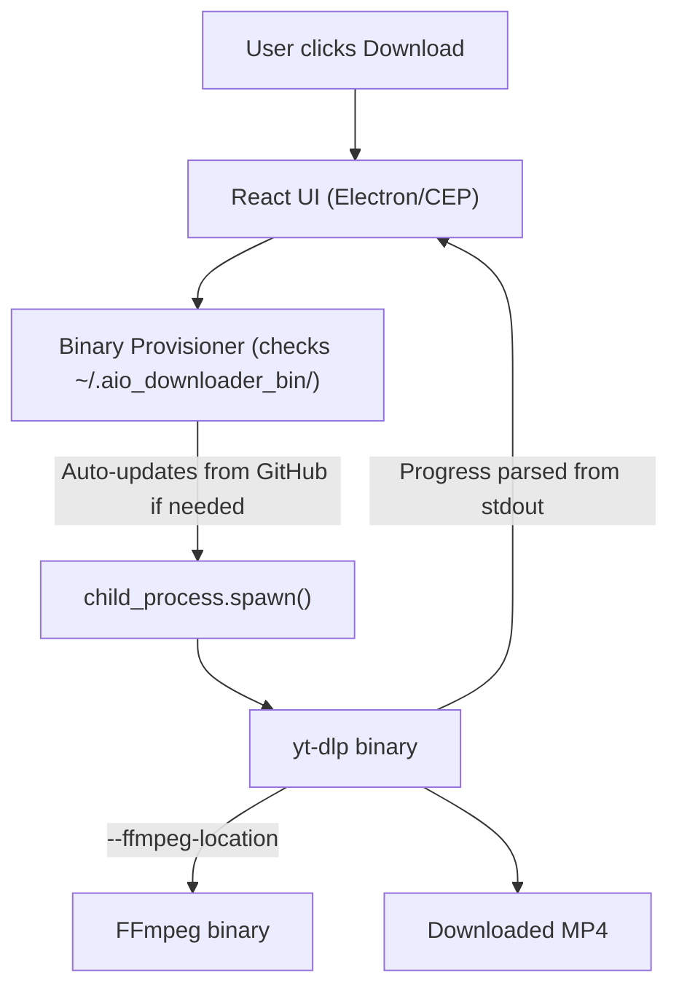

# System Architecture

## App Flow
1. **Provisioning Flow (First Run / Auto-Update)**: The app silently checks a local directory (e.g., `~/.aio_downloader_bin/`) for `yt-dlp` and `ffmpeg` binaries. If they are missing or older than 7 days, it auto-downloads the latest versions from their official GitHub releases.
2. **Downloader Flow**: User pastes URL -> App fetches video metadata -> User selects quality and segment -> App executes `yt-dlp` as a child process -> Video saved to disk.
3. **Player Flow (Extensions)**: User opens Extension panel -> Drags a video file OR completes a download -> Video loads into custom HTML5 player -> User scrubs frame-by-frame to use as reference.

## System Architecture
The project is divided into three main interfaces sharing a common core logic:

1. **Binary Provisioner**: A Node.js module responsible for downloading, setting permissions (chmod, macOS xattr), and auto-updating the standalone `yt-dlp` and `ffmpeg` binaries.
2. **Core Downloader Engine**: A Node.js module executing `yt-dlp` via `child_process.spawn()`. It utilizes advanced arguments (parallel connections, retries, geo-bypassing, format filtering) and parses stdout `[download]` tags for real-time progress.
3. **Standalone Desktop App**: Built with **Electron**, providing a desktop window for the React frontend and exposing the Core Downloader Engine via Electron IPC.
4. **Adobe Extensions**: Built using **Adobe CEP (Common Extensibility Platform)**. The frontend is the same React app, but the backend is a Node.js process spawned by CEP (enabled via `--enable-nodejs`). ExtendScript (.jsx) is used for host app (Premiere/AE) awareness.

## Folder & File Structure
```text
/
├── apps/
│   ├── standalone/          # Electron app shell
│   ├── premiere-ext/        # Premiere Pro CEP extension shell & ExtendScript
│   └── ae-ext/              # After Effects CEP extension shell & ExtendScript
├── packages/
│   ├── core-downloader/     # Binary provisioner & yt-dlp child_process spawn logic
│   ├── ui-components/       # Shared React components (Player, Forms, Buttons)
│   └── shared-utils/        # Helpers, timecode parsers, error handlers
├── docs/                    # Documentation
├── package.json             # Root monorepo config
└── tsconfig.json
```

## Tech Stack
- **Frontend Framework**: React 18, TypeScript.
- **Styling**: Tailwind CSS (configured for Adobe Dark Theme).
- **Desktop Wrapper**: Electron.
- **Adobe Integration**: Adobe CEP (HTML5 + Node.js + ExtendScript).
- **Process Execution**: Native Node.js `child_process.spawn()`.
- **Downloader Backend**: Standalone `yt-dlp` binaries and `ffmpeg` (for merging/transcoding).
- **Video Player**: Custom React component wrapping HTML5 `<video>` with advanced frame manipulation libraries.
- **Monorepo Management**: Turborepo + npm / pnpm workspaces.

## Downloader Execution Flow Diagram


## Database/API Flow
- **No traditional database** is required. Settings (last output location, default quality) are stored locally via `electron-store` or `localStorage`.
- **External API Flow**: The app makes requests directly to social media platforms via `yt-dlp`. Binaries are fetched directly from GitHub Releases (`github.com/yt-dlp/yt-dlp` and `github.com/eugeneware/ffmpeg-static`).
