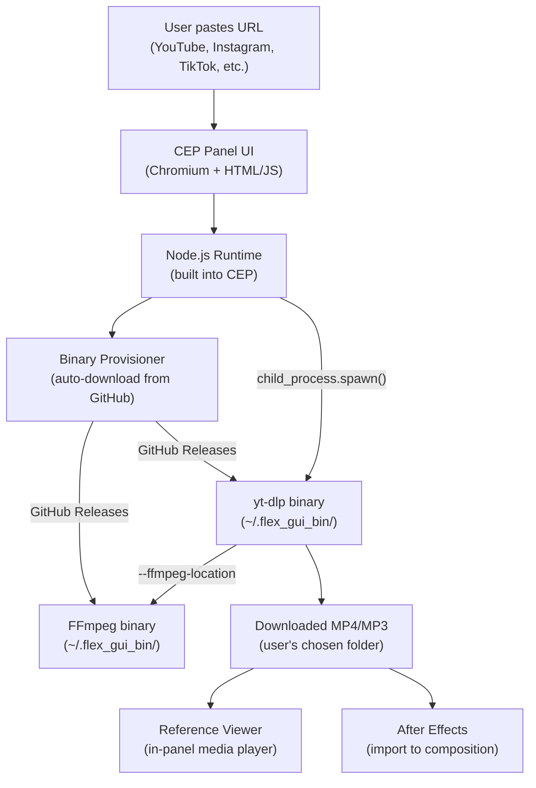

# Video Download System Analysis — Flex GUI Pro

## Summary

The **Flex GUI Pro** After Effects extension (v6.5.0) uses **[yt-dlp](https://github.com/yt-dlp/yt-dlp)** as its core video download engine, combined with **FFmpeg** for stream merging and transcoding. Everything runs locally on the user's machine — no third-party APIs or cloud services are involved.

---

## Core Technology Stack

| Component | Technology | Purpose |
|-----------|-----------|---------|
| **Video Downloader** | [yt-dlp](https://github.com/yt-dlp/yt-dlp) (standalone binary) | Downloads video/audio from 1000+ sites |
| **Stream Merger/Transcoder** | [FFmpeg](https://github.com/eugeneware/ffmpeg-static) (static binary) | Merges separate video+audio streams, converts codecs |
| **Runtime** | Node.js (via CEP `--enable-nodejs`) | Spawns processes, file I/O, HTTP downloads |
| **Host Platform** | Adobe CEP (Common Extensibility Platform) | Embeds Chromium + Node.js inside After Effects |
| **Process Execution** | `child_process.spawn()` | Runs yt-dlp/FFmpeg as child processes |

---

## How It Works — Step by Step

### 1. Binary Provisioning (Auto-Download)
Both binaries are **auto-downloaded on first use** to `~/.flex_gui_bin/`:

**yt-dlp:**
- Windows: `https://github.com/yt-dlp/yt-dlp/releases/latest/download/yt-dlp.exe`
- macOS: `https://github.com/yt-dlp/yt-dlp/releases/latest/download/yt-dlp_macos`
- Auto-updates if binary is **older than 7 days**

**FFmpeg:**
- Windows: `https://github.com/eugeneware/ffmpeg-static/releases/download/b5.0.1/win32-x64`
- macOS ARM: `https://github.com/eugeneware/ffmpeg-static/releases/download/b5.0.1/darwin-arm64`
- macOS Intel: `https://github.com/eugeneware/ffmpeg-static/releases/download/b5.0.1/darwin-x64`

Both are stored at: `<user_home>/.flex_gui_bin/`

### 2. Download Execution
The function `triggerYtDownload()` (defined in [main.js](file:///c:/Users/tsdzs/AppData/Roaming/Adobe/CEP/extensions/com.flexguipro.ext/client/js_flex/main.js) — base64-encoded, line ~4704 decoded):

```
User pastes URL → ensureFfmpegBinary() → ensureYtDlpBinary() → cp.spawn(binaryPath, args)
```

### 3. yt-dlp Command Arguments
The extension builds a sophisticated argument set:

```bash
yt-dlp \
  -N 8                           # 8 parallel connections
  --concurrent-fragments 10      # 10 concurrent fragment downloads
  --force-ipv4                   # Force IPv4
  --extractor-retries 10         # Retry extractors 10x
  --fragment-retries 10          # Retry fragments 10x
  --retry-sleep 5                # Wait 5s between retries
  --no-check-certificates        # Skip SSL verification
  --geo-bypass                   # Bypass geo-restrictions
  -f 'bv+ba/b'                   # Best video + best audio (merge)
  -S 'res:desc,fps:desc,...'     # Sort by resolution, fps, HDR, codec
  --merge-output-format mp4      # Output as MP4
  --ffmpeg-location <binDir>     # Point to local FFmpeg
  -o '<folder>/%(title)s.%(ext)s'
  --newline                      # For progress parsing
  <URL>
```

### 4. Format Options Available

| Format ID | Description | FFmpeg Required? |
|-----------|-------------|:---:|
| `video_best` | Best quality (merged streams) | ✅ Yes |
| `video_1080p_merged` | True 1080p | ✅ Yes |
| `video_720p_merged` | True 720p | ✅ Yes |
| `video_480p_merged` | 480p | Optional |
| `audio_best` | Best audio → MP3 | ✅ Yes |
| `audio_m4a` | M4A/AAC audio | No |

### 5. Progress Tracking
- Parses `[download] XX.X%` from yt-dlp stdout
- Captures `Destination: <path>` to locate the final file
- Displays real-time progress bar in the extension UI

### 6. Post-Download Integration
After download completes:
- Loads the file into the **reference viewer** panel (built-in media player)
- Adds to **recent downloads** history
- File is ready for import into After Effects composition

---

## Additional Features

| Feature | How |
|---------|-----|
| **Playlist support** | `--yes-playlist` / `--no-playlist` flags |
| **Section download** | `--download-sections *HH:MM:SS-HH:MM:SS` |
| **Force exact resolution** | Changes `<=` operator to `=` in format filter |
| **Custom save folder** | User-selectable download directory |
| **Invidious URL normalization** | `yewtu.be` → `youtube.com` before passing to yt-dlp |
| **macOS quarantine bypass** | `xattr -c` + `chmod 755` on downloaded binaries |
| **Auto-update** | Deletes binary if >7 days old, re-downloads latest |
| **AE-compatible transcode** | Post-download FFmpeg transcode to AE-friendly codecs |

---

## Architecture Diagram



---

## Key Source Files

| File | Role |
|------|------|
| [js_flex/main.js](file:///c:/Users/tsdzs/AppData/Roaming/Adobe/CEP/extensions/com.flexguipro.ext/client/js_flex/main.js) | Base64-encoded core logic (download engine, binary provisioning) |
| [index.html](file:///c:/Users/tsdzs/AppData/Roaming/Adobe/CEP/extensions/com.flexguipro.ext/client/index.html) | UI (downloader modal at ~L5957, FFmpeg transcode at ~L17809) |
| [manifest.xml](file:///c:/Users/tsdzs/AppData/Roaming/Adobe/CEP/extensions/com.flexguipro.ext/CSXS/manifest.xml) | CEP config: `--enable-nodejs`, `--disable-web-security` |

> [!NOTE]
> The download functions are **obfuscated** — `js_flex/main.js` wraps all code in `eval(decodeURIComponent(escape(atob("..."))))`. The actual function `triggerYtDownload` is at approximately line 4704 in the decoded content.
